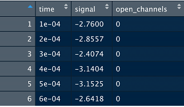

# WebCrawler
 Web Crawling Using R
 
 ----------------------------------------------------
The Logic behind the Code and Complexity
----------------------------------------------------
>>Through our code we will be fetching the number of journal printed in a given year.

>>As we have employed the two nested loops for the purpose.Thus the complexity of the function is O(n2).

>>We are Preparing a link based on the year parameter that is passed in the function.
  If we pass 2020 then the below link will be formed.
  "https://www.g3journal.org/content/by/year/2020"
  
>>use the below command to run the file.
  journal_year(2020) or journal_year("2020")
  
>>Then we are fetching the the total number of months in this year when the journal was published.
  Take the example of year 2020.
  In 2020 the journal were published in the below months.
  1.Jan :The total journals published were 40
  2.Feb :The total journals published were 43
  3.March :The total journals published were 30
  
>>Thus through our code we will fetch the deatils for 113 journals and store it in a CSV file.

>>For some articles like https://www.g3journal.org/content/9/12/4247.full
  The details are missing in the journal pages and NA will be inserted for them.
  
-----------------------------------------------------
Challenges we met
-----------------------------------------------------

1>In the begining, we could not extract the four fields: Author Affiliations, Corresponding Author,Corresponding Author's Email and
        Publication Date. Then we found that the link to these field is not the same as others. For example, if we extract publication date
        and authors, the link to which is https://www.g3journal.org/content/3/12/2105. If We need to extract the four fields, we need to add
        ".article-info" to the link, like https://www.g3journal.org/content/3/12/2105.article-info.

2> Getting Corresponding Author's Email is another challenge. We need to extract the emails from Corresponding Author, but some have one email
   and some have two emails. We applied regular extracting and found that the "{at}", which shows in the email format, is a special case that
        causes some errors.
  
3>For some of the links we get HTTP 501 error but this is a server side issue and not in the code.
  
------------------------------------------------------
In the below section the program is explained
------------------------------------------------------
1>First we load the required packages.

   ibrary(robotstxt)
   library(rvest)
   library(selectr)
   library(xml2)
   library(dplyr)
   library(stringr)
   library(forcats)
   library(magrittr)
   library(tidyr)
   library(ggplot2)
   library(lubridate)
   library(tibble)
   library(purrr)

2>Here we will be loading the main link on the basis of the year.

   year<-"2020"
   path<-"https://www.g3journal.org/content/by/year/"
   path_link<-paste(path,year)
   path_link<-gsub(" ","",path_link)
   
   paths_allowed(
     paths = c(path_link)
   )

3>These are the vectors that will be used to store the values.These will be inserted in the dataframe as columns.

   DOI_val<-c()
   Tit_val<-c()
   Auth_val<-c()
   Author_Affil_val<-c()
   Corresp_Author_val<-c()
   Corresp_Auth_Email_val<-c()
   Public_Date_val<-c()
   Abstract_val<-c()
   Keywords_val<-c()
   Full_Text_val<-c()
   
   load_page<-read_html(path_link)

4>This will give us the number of moths in a given year.
   load_page %>%
     html_nodes(".hw-issue-meta-data") %>%
     html_text() -> month_count

5>This will give us the links of the individual months.
    load_page %>%
      html_nodes(".hw-issue-meta-data") %>%
      html_attr("href")->month_links
    
    base_link<-"https://www.g3journal.org"
    
    indiv_links<-c(month_links)
    no_of_months<-length(month_links)
    months<-paste("Journals were printed in ",no_of_months, " months in ",year)
    print(months)
	
6>This is the nested loop which will first fetch the Total journals in a month.
  After that it will fetch the individual deatils of each journal.
  
    for(i in 1:length(indiv_links)){
      
      #Here we create the link for the individual months.
      main_str<-paste(base_link,indiv_links[i])
      
      #use this link to open all the journals for a month.
      final_str<-gsub(" ","",main_str)
      
      #This will load the page for a particular month.
      month_journals<-read_html(final_str)
      
      #This will give the list of the journals in a month.
      month_journals %>%
        html_nodes(".highwire-cite-linked-title") %>%
        html_text() -> journals_in_month
      
      #This will give the link of the journals in a month.
      month_journals %>%
        html_nodes(".highwire-cite-linked-title") %>%
        html_attr("href") ->link_journals_in_month
      
      print(length(journals_in_month))
      months_jorn<-length(journals_in_month)
      months_string<-paste("There are ",months_jorn," journals for this month")
      print(months_string)
	  
7>This loop will run through the individual details of each journal.

    for(j in 1:length(journals_in_month)){
      
      month_links<-c(link_journals_in_month)
      
      sep_journal_links<-paste(base_link,month_links[j])
      
      sep_journal_links<-gsub(" ","",sep_journal_links)
      
      #print(sep_journal_links)
      
      #Here we will be loading the the page for a particular journal.
      final_page<-read_html(sep_journal_links)
      
      #Fetching the Title of the journal from the webpage.
      final_page %>% 
        as.character() %>% 
        read_html() %>% 
        html_nodes(xpath = '//meta[@name="DC.Title"]') %>% 
        html_attr('content')->Title
      
      Tit_val<-c(Tit_val,Title[1])
      
      #Fetching the keywords of the journal from the webpage.
      final_page %>%
        html_nodes(".kwd") %>%
        html_text() -> Key
      
      Key_val<-paste(Key,collapse=" ")
      Key<-gsub(" ",",",Key_val)
      Keywords_val<-c(Keywords_val,Key)
      
      #Fetching the DOI of the journal from the web page.
      final_page %>%
        html_nodes(".highwire-cite-metadata-doi") %>%
        html_text() -> DOI
      
      DOI_val<-c(DOI_val,DOI[1])
    
      #Fetching the Abstract of the journal from the webpage.
      final_page %>%
        html_nodes(".section.abstract") %>%
        html_text() -> Abstract
      
      #final_page %>% 
      #as.character() %>% 
      #read_html() %>% 
      #html_nodes(xpath = '//meta[@name="citation_abstract"]') %>% 
      #html_attr('content')->Abstract
      
      if(length(Abstract)<1){
        print(sep_journal_links)
        Abstract_val<-c(Abstract_val,"NA")
      }else{
        Abstract_val<-c(Abstract_val,Abstract)
      }
    
      #Fetching the Authors from the webpage.
      final_page %>%
        html_nodes(".highwire-citation-authors") %>%
        html_text() -> Authors
      
      #Auth_val<-paste(Authors[1],collapse=" ")
      #Authors<-gsub(" ",",",Auth_val)
      Auth_val<-c(Auth_val,Authors[1])
      
      
      #Fetching the publication dat from the webpage.
      final_page%>%html_nodes(".highwire-cite-metadata-date")%>%
        html_text() -> pdate
      
      Public_Date_val<-c(Public_Date_val,pdate[1])
    
    
      #Creating a new link for the remaininf fields.
      add_val<-".article-info"
      new_link<-paste(sep_journal_links,add_val)
      new_link<-gsub(" ","",new_link)
      new_link<- read_html(new_link)
      
      
      #Fetching the list of the corresponding authors.
      new_link %>%html_nodes(".corresp")%>%
        html_text()->corresp_author
      
      Corresp_Author_val<-c(Corresp_Author_val,corresp_author[1])
      
      
      #Fetching the corresponding authors email.
      new_link %>%html_nodes(".corresp")%>%
      html_text()->corresp_author_email
    
      Corresp_Auth_Email_val<-c(Corresp_Auth_Email_val,corresp_author_email[1])
      
      
      #Fetching the author affiliations.
      new_link %>%html_nodes(".aff")%>%
        html_text()->author_affli
      
      Author_colap<-paste(author_affli,collapse="//")
      Author_Affil_val<-c(Author_Affil_val,Author_colap)
      
      
      #Fetching the link of the full text.
      full_text<-".full"
      full_text<-paste(sep_journal_links,full_text)
      full_text<-gsub(" ","",full_text)
      
      Full_Text_val<-c(Full_Text_val,full_text)
      }
    }
	
8>Here we will create the dataframe and assign these individual vectors to the dataframe.

    Journal_File<-data.frame(DOI=DOI_val,
                             Title=Tit_val,
                             Authors=Auth_val,
                             Author_Affiliations=Author_Affil_val,
                             Corresponding_Author=Corresp_Author_val,
                             Corresponding_Authors_Email=Corresp_Auth_Email_val,
                             Publication_Date=Public_Date_val,
                             Abstract=Abstract_val,
                             Keywords=Keywords_val,
                             Full_Text=Full_Text_val)
    
9>Print the total length of each vectors.

    print(length(DOI_val))
    print(length(Tit_val))
    print(length(Auth_val))
    print(length(Author_Affil_val))
    print(length(Corresp_Author_val))
    print(length(Corresp_Auth_Email_val))
    print(length(Public_Date_val))
    print(length(Abstract_val))
    print(length(Keywords_val))
    print(length(Full_Text_val))

10>In the end we will write this dataframe to the CSV File.

    write.csv(Journal_File,"Test.csv", row.names = FALSE)
    

